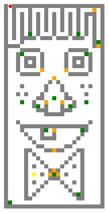

# Escape Game Manga v1

**_Projet réalisé lors de ma formation Apprendre à coder avec Python de l'Université Libre de Bruxelles (ULB) sur la plate-forme FUN_**

_**Jeu d'évasion avec quizz thème manga**_

## Installation

* Hypothèse: python min 3.9.1 déjà installé

* Le code n'utilise que la bibliothèque standard de python dont turtle

* Créer nouveau répertoire et y copier les fichiers de code et les fichiers d'entrées:

	* escape_game_manga.py
	* CONFIGS.py

	* dico_objets_manga.txt
	* dico_portes_manga.txt
	* plan_chateau_manga.txt

* Si vous le souhaitez, vous pouvez créer vos propres input. Il faudra penser à les noter dans le fichier CONFIGS.py

## Lancer le jeu

* Ouvrir un terminal powershell et saisir la commande `python escape_game_manga.py`

## Consignes du jeu

* Le personnage se déplace grâce aux flèches de direction.
* Des indices sont cachés dans les objets.
* Les réponses aux questions permettent d'ouvrir les portes.
* Il faut ramasser tous les objets pour ouvrir la porte de sortie.

_**Bon jeu !**_
